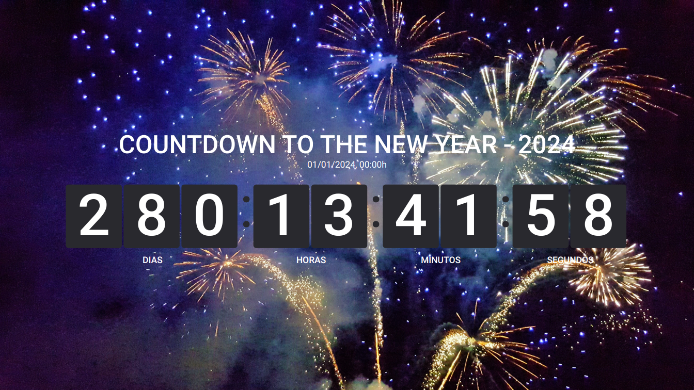
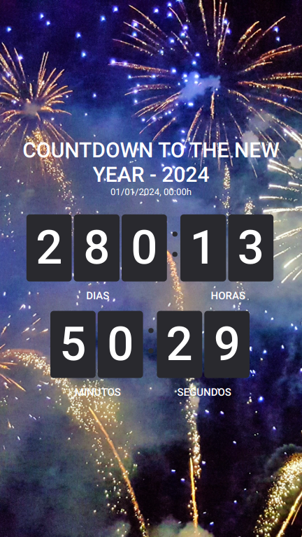
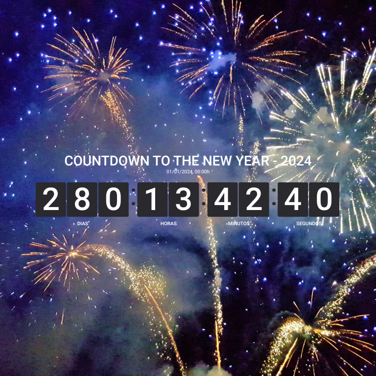

# DSPLAY - Countdown
- Template to display a countdown.

## Supported Screen Formats/Resolutions

- Landscape

  
- Portrait

  
- Square

  

## Getting started
```
  git clone https://github.com/dsplay/template-countdown.git my-awesome-template
  cd my-awesome-template
  rm -rf .git
  npm install
  npm start
```

## Packing (release build)
  To create a release build of the template, ready to be uploaded to DSPLAY, just run:
  ```
    npm run zip
  ```
  It will generate a template.zip file ready to be deployed to [DSPLAY Web Manager](https://manager.dsplay.tv/template/create)

## More

The see more about DSPLAY HTML Templates, visit: https://developers.dsplay.tv/docs/html-templates
